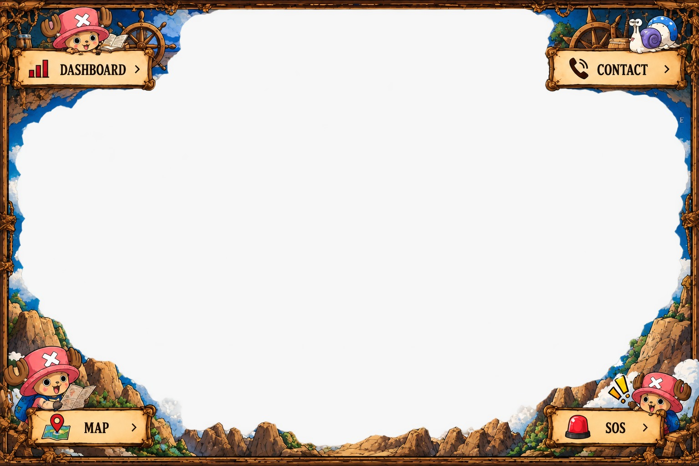
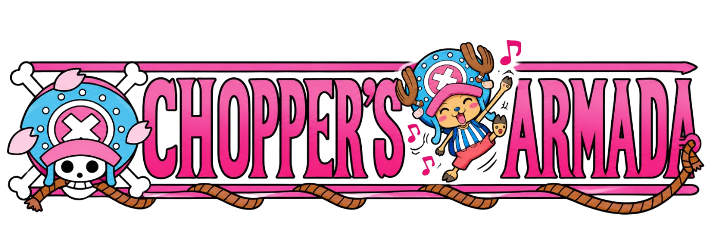

<!-- PROJECT IMAGE / BANNER -->
<p align="center">
  
</p>

# 🐌 Den Den Mushi SOS (Yonko Emergency Network)

> A premium, immersive, One Piece-inspired emergency coordination system and interactive 3D Den Den Mushi transponder network with real-time Firebase dispatch, tactical triage dashboard, maritime radar map, and synthesized audio.

---

## 📖 Description

**Den Den Mushi SOS** is a high-performance Next.js 15 application designed as a Grand Line emergency transponder and maritime dispatch network. It bridges nostalgic *One Piece* lore with modern web engineering, featuring an interactive 3D Den Den Mushi (both procedural and GLB models), eye/face tracking via pointer and webcam, a custom Web Audio synthesizer recreating the iconic *"purupuru"* transponder ringtone and speech engine, real-time Firebase Realtime Database synchronizations, a TanStack-powered tactical triage dashboard, and Chopper Medical Armada emergency coordination.

Highlights:
- **Interactive 3D Transponder Snail (Den Den Mushi)** rendered via Three.js / React Three Fiber with procedural shell styling and Law GLB model support
- **Web Audio "Purupuru" Synthesizer & Speech Engine** reproducing authentic snail ringtones, receiver clicks, and spoken audio feedback
- **Webcam & Pointer Face Tracking** causing the 3D snail's eye stalks and head to dynamically follow the user
- **Live 2-Way Real-time Firebase Chat & SOS Dispatch** bridging civilian distress calls with HQ Marine & Pirate monitors
- **Tactical Priority Queue Dashboard** built with TanStack Table, priority filtering, and dynamic live status updates
- **Grand Line Parchment Theme** with custom One Piece Log Pose compass cursor, authentic scroll textures, and Lottie animations
- **Universal Embeddable Widget Generator** providing ready-to-use HTML iFrame, Custom Web Component, and React/Next.js snippets

<p><em>This is for education purposes only. I, the creator, am not earning a single rupee from this.</em></p>

---

## ✨ Features

- **Interactive 3D Den Den Mushi Viewport** – Procedural and GLB transponder snail rendering with animated mouth movements, shell rotations, audio-reactive vibrational feedback, and camera orbital controls.
- **Webcam & Cursor Eye Tracking** – Den Den Mushi's eye stalks and head smoothly track the caller's face using webcam computer vision or mouse movement.
- **Audio Synthesizer & Speech** – Built-in Web Audio API oscillator reproducing realistic *"purupuru"* rings, connection clicks, and text-to-speech voice broadcasts.
- **Live Firebase Distress Chat** – Synchronous two-way emergency communication channel with timestamps, emotion states, and caller frequency indicators.
- **Instant SOS Beacon Dispatch** – Civilian emergency transmission form on ancient parchment scroll with Grand Line island sector selection, severity rating, and celebration confetti.
- **Tactical Triage Dashboard** – High-density responsive operations command center with sortable, filterable TanStack tables, queue statistics, and dispatch status transitions (`queued`, `dispatched`, `resolved`).
- **Chopper Medical Armada Fleet** – Emergency fleet allocation interface for dispatching medical aid across Grand Line sectors.
- **Grand Line Tactical Map** – Nautical sector overview map for tracking island dispatches and transponder frequencies.
- **Universal Embed Modal** – One-click code generation for embedding the 3D Transponder Snail into any external website via iFrame, Web Component, or React snippet.
- **One Piece Aesthetic & Log Pose Cursor** – Ancient scroll styling, animated ocean cinematic backgrounds, and custom compass pointer cursor.

---

## 🧠 Tech Stack

**Frontend & Architecture**
- Next.js 15 App Router (Static Export & Appwrite ready)
- React 19
- TypeScript
- Tailwind CSS 4 (`@tailwindcss/postcss`)
- Radix UI Primitives (Alert Dialog, Select, Popover, Dropdown Menu, Checkbox)
- Lucide React Icons

**3D Graphics & Physics**
- Three.js
- React Three Fiber (`@react-three/fiber`)
- Drei (`@react-three/drei`)
- GLTF / GLB Loader (Trafalgar Law Transponder Snail Model)

**Audio & Computer Vision**
- Web Audio API (Procedural "Purupuru" Tone Generator & Frequency Oscillators)
- Web Speech Synthesis API
- Face Tracking Engine (Webcam video coordinates & pointer vector mapping)

**Data & Realtime State**
- Firebase Realtime Database (Live chat messages & emergency dispatch tickets)
- TanStack Table (`@tanstack/react-table` for tactical triage queue)
- LocalStorage State Synchronization Fallback

**Visual Effects & Sensory UI**
- Lottie Web (`lottie-web` for high-seas nautical loaders)
- Canvas Confetti (`canvas-confetti` for emergency dispatch celebrations)
- Custom One Piece Log Pose Compass Cursor

---

## 🏗️ Architecture / Workflow

```text
Civilian / Pirate (SOS) → 3D Den Den Mushi / SOS Form → Firebase Realtime Database
                                    ↓                                ↓
                       Audio Purupuru & Voice               HQ Tactical Radar
                                                                     ↓
                                                    Chopper Medical Armada Dispatch
                                                                     ↓
                                                    Grand Line Priority Queue Table
```

---

### Quick Start (Windows)

```bash
# Clone the repository
git clone https://github.com/DevRanbir/yonkooo.git

# Navigate to project
cd yonkooo

# Install dependencies
npm install

# Start development server
npm run dev
```

Open:

```text
http://localhost:3000
```

---

### Manual Setup

**1. Install dependencies**

```bash
npm install
```

**2. Configure environment**

Create `.env.local` in the project root:

```env
# Firebase Realtime Database Configuration
NEXT_PUBLIC_FIREBASE_API_KEY=your_firebase_api_key
NEXT_PUBLIC_FIREBASE_AUTH_DOMAIN=your_project.firebaseapp.com
NEXT_PUBLIC_FIREBASE_DATABASE_URL=https://your_project-default-rtdb.firebaseio.com
NEXT_PUBLIC_FIREBASE_PROJECT_ID=your_project_id
NEXT_PUBLIC_FIREBASE_STORAGE_BUCKET=your_project.firebasestorage.app
NEXT_PUBLIC_FIREBASE_MESSAGING_SENDER_ID=your_messaging_sender_id
NEXT_PUBLIC_FIREBASE_APP_ID=your_firebase_app_id
NEXT_PUBLIC_FIREBASE_MEASUREMENT_ID=your_measurement_id
```

**3. Run the development server**

```bash
npm run dev
```

**4. Production build & Static export**

```bash
npm run build
```
*Note: Configured with `output: 'export'` in `next.config.js` to automatically generate the production `./out` directory for static hosting (Appwrite Sites, Vercel, GitHub Pages, Netlify, or Docker).*

**5. Lint**

```bash
npm run lint
```

---

## 🐳 Docker & Hosting Support

This application is built for static deployment (`output: 'export'`) and can be deployed to any static host or web container (Appwrite Sites, Nginx, Caddy, Vercel, Cloudflare Pages).

**Static Build Pipeline:**

```bash
npm install
npm run build
# The optimized static distribution is emitted to ./out
```

**Docker / Nginx Serving:**

```dockerfile
FROM nginx:alpine
COPY ./out /usr/share/nginx/html
EXPOSE 80
CMD ["nginx", "-g", "daemon off;"]
```

---

## 🔐 Environment Variables

Create `.env.local` in the project root:

```env
NEXT_PUBLIC_FIREBASE_API_KEY=your_firebase_api_key
NEXT_PUBLIC_FIREBASE_AUTH_DOMAIN=your_project.firebaseapp.com
NEXT_PUBLIC_FIREBASE_DATABASE_URL=https://your_project-default-rtdb.firebaseio.com
NEXT_PUBLIC_FIREBASE_PROJECT_ID=your_project_id
NEXT_PUBLIC_FIREBASE_STORAGE_BUCKET=your_project.firebasestorage.app
NEXT_PUBLIC_FIREBASE_MESSAGING_SENDER_ID=your_sender_id
NEXT_PUBLIC_FIREBASE_APP_ID=your_app_id
NEXT_PUBLIC_FIREBASE_MEASUREMENT_ID=optional_measurement_id
```

Notes:
- `NEXT_PUBLIC_FIREBASE_DATABASE_URL` is required for live 2-way 3D transponder snail chat and synchronized SOS emergency tickets.
- If Firebase environment variables are not provided, the application gracefully defaults to in-memory/localStorage dispatch persistence and autonomous Den Den Mushi AI replies.

---

## 🧪 Usage

- **Step 1:** Launch the development server with `npm run dev`
- **Step 2:** Open `http://localhost:3000` to experience the cinematic unfolding-map landing page
- **Step 3:** Navigate to `/contact` to converse with the interactive 3D Den Den Mushi transponder snail, test face/pointer tracking, and toggle sound effects
- **Step 4:** Navigate to `/request` to transmit an emergency SOS distress call with sector selection and severity classification
- **Step 5:** Open `/dashboard` to monitor the real-time priority queue, filter by Grand Line sea/island, and update dispatch states
- **Step 6:** Visit `/team` to view the Chopper Medical Armada emergency triage dispatch unit

Example interactive workflows:

```text
1. Visit /contact → Click "DIAL DISTRESS CALL" → Den Den Mushi triggers purupuru rings and connects to Firebase Channel 07.
2. Visit /request → Select "Wano Country - Flower Capital" → Severity: "Critical (Yonko Level Threat)" → Submit SOS.
3. Open /dashboard → Watch the newly submitted SOS appear in real-time in the priority table.
```

---

## 🖼️ Screenshots

<p align="center">
  
  
  <br/>
  
  
</p>

---

## 📂 Project Structure

```text
yonkooo/
├── README.md
├── next.config.js
├── package.json
├── package-lock.json
├── postcss.config.mjs
├── tsconfig.json
├── app/
│   ├── contact/
│   │   └── page.tsx
│   ├── dashboard/
│   │   └── page.tsx
│   ├── map/
│   │   └── page.tsx
│   ├── request/
│   │   └── page.tsx
│   ├── team/
│   │   └── page.tsx
│   ├── globals.css
│   ├── layout.tsx
│   ├── loading.tsx
│   ├── not-found.tsx
│   └── page.tsx
├── components/
│   ├── dendenmushi/
│   │   ├── ArmadaHqCommandCenter.tsx
│   │   ├── CallerDistressTerminal.tsx
│   │   ├── CustomizerPanel.tsx
│   │   ├── DenDenMushi3D.tsx
│   │   ├── DenDenMushiCanvas.tsx
│   │   ├── DenDenMushiGLB.tsx
│   │   ├── DenDenMushiUI.tsx
│   │   ├── DistressFormModal.tsx
│   │   ├── EmbedModal.tsx
│   │   ├── EmergencyTriagePanel.tsx
│   │   └── HeaderNav.tsx
│   ├── ui/
│   │   ├── alert-dialog.tsx
│   │   ├── badge.tsx
│   │   ├── button.tsx
│   │   ├── checkbox.tsx
│   │   ├── dropdown-menu.tsx
│   │   ├── input.tsx
│   │   ├── label.tsx
│   │   ├── pagination.tsx
│   │   ├── popover.tsx
│   │   ├── select.tsx
│   │   └── table.tsx
│   ├── comp-485.tsx
│   ├── custom-drawer-select.tsx
│   ├── dispatch-provider.tsx
│   ├── emergency-card.tsx
│   ├── ocean-background.tsx
│   ├── screen-transition-loader.tsx
│   └── site-nav.tsx
├── lib/
│   ├── dendenmushi/
│   │   ├── aiBrain.ts
│   │   ├── characterPresets.ts
│   │   ├── faceTracker.ts
│   │   ├── firebaseChat.ts
│   │   ├── mushi.ts
│   │   ├── networkSync.ts
│   │   ├── seedGenerator.ts
│   │   └── soundEngine.ts
│   ├── firebase.ts
│   ├── types.ts
│   └── utils.ts
└── public/
    ├── audio/
    │   ├── call_cut.mpeg
    │   ├── emergency_puru.mpeg
    │   ├── msg_sent_alert.mpeg
    │   └── normal_puru.mpeg
    ├── models/
    │   ├── ddm_law_lowpoly.glb
    │   └── den_den_mushi_law.glb
    ├── cursor.png
    ├── cursor-pointer.png
    ├── backgroundScroll.png
    ├── landing-command-frame.png
    ├── Loading.json
    └── Logo.png
```

---

## 🚧 Future Improvements

- [ ] Add WebRTC peer-to-peer live voice calls between connected Den Den Mushi transponders
- [ ] Add more iconic One Piece snail presets (Golden Buster Call Mushi, Black Wiretapping Mushi, Silver Mushi)
- [ ] Add interactive Grand Line weather storm hazards on the navigation map
- [ ] Add soundboard sound effects for Marine Buster Call alarms
- [ ] Add multi-island GPS simulation with moving pirate and marine fleet markers
- [ ] Add push notifications for urgent Yonko-level threats
- [ ] Add user authentication with Marine Admiral vs. Pirate Captain privilege roles
- [ ] Add WebGL post-processing CRT vintage transponder screen shaders

---

## 🛠️ Troubleshooting

**Audio is not playing ("Purupuru" or voice speech)**
- Modern browsers block audio autoplay until the user interacts with the page. Click anywhere in the 3D terminal or click **"DIAL DISTRESS CALL"** to enable the Web Audio context.
- Verify that the speaker/mute icon in the 3D HUD is not toggled to muted.

**3D Den Den Mushi is not rendering or canvas is black**
- Ensure your browser supports WebGL 2.0 and hardware acceleration is enabled in browser settings.
- Verify that `public/models/ddm_law_lowpoly.glb` exists if testing GLB model mode.

**Firebase real-time sync is not connecting**
- Check that `NEXT_PUBLIC_FIREBASE_DATABASE_URL` is set in `.env.local`.
- Ensure your Firebase Realtime Database security rules allow read/write for development:
  ```json
  {
    "rules": {
      ".read": true,
      ".write": true
    }
  }
  ```

**Appwrite / Static Deployment missing `./out` directory**
- Ensure `next.config.js` has `output: 'export'` and `images: { unoptimized: true }`.
- Run `npm run build` locally to verify that the `./out` folder is successfully generated.

---

## 👥 Team / Author

* **Name:** DevRanbir
* **GitHub:** [https://github.com/DevRanbir](https://github.com/DevRanbir)
* **Project Repository:** [https://github.com/DevRanbir/yonkooo](https://github.com/DevRanbir/yonkooo)

---

## ⚠️ Disclaimer

This project is a fan-created, non-commercial educational project inspired by Eiichiro Oda's *One Piece* manga and anime series. All *One Piece* names, characters, sound references, and intellectual properties belong to **Eiichiro Oda**, **Shueisha**, and **Toei Animation**.

*This is for education purposes only. I, the creator, am not earning a single rupee from this.*

---

## 📜 License

This project is licensed under the MIT License.

---

## 🙏 Acknowledgments

- **Eiichiro Oda & Toei Animation** for the iconic world of One Piece and transponder snails (Den Den Mushi)
- **Next.js & React Teams** for the App Router architecture
- **Three.js & React Three Fiber Community** for 3D web rendering capabilities
- **Firebase** for real-time database infrastructure
- **Radix UI & Tailwind CSS** for accessible, responsive design primitives
- **Open Source Community**
